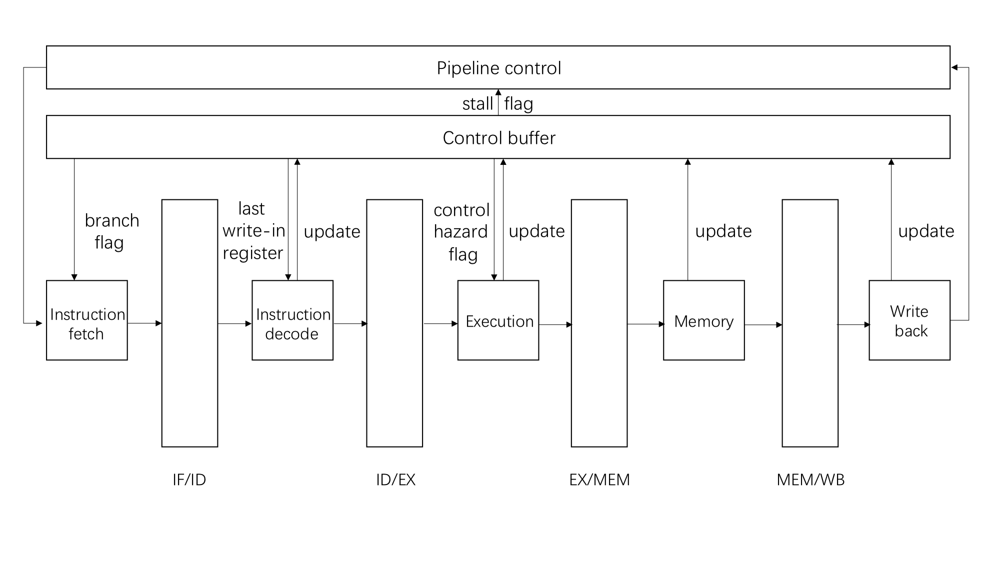

# Part2-design

> A detailed document that describes the design process and solution.

At this part, two versions of pipeline cpu will be designed: `with-stall` and `data-forward`.

## Instruction list

All the instructions we need to implement are as follows:

| Instruction | OP Code | ALUSrcA | ALUSrcB |  ALUOp  | Dst  |  Branch   |
| :---------: | :-----: | :-----: | :-----: | :-----: | :--: | :-------: |
|     nop     |  0x00   |   DNA   |   DNA   | ALU_NOP | DNA  |     ×     |
|     add     |  0x40   |   in1   |   in2   | ALU_ADD | out1 |     ×     |
|    addu     |  0x42   |   in1   |   in2   | ALU_ADD | out1 |     ×     |
|    addiu    |  0x43   |   in1   |   imm   | ALU_ADD | out1 |     ×     |
|     lw      |  0x28   |   in2   |   imm   | ALU_ADD | out1 |     ×     |
|     sw      |  0x34   |   in2   |   imm   | ALU_ADD | DNA  |     ×     |
|    andi     |  0x4f   |   in1   |   imm   | ALU_AND | out1 |     ×     |
|     sll     |  0x55   |   in1   |  shamt  | ALU_SLL | out1 |     ×     |
|    slti     |  0x5c   |   in1   |   imm   | ALU_SLT | out1 |     ×     |
|     lui     |  0xa2   |   DNA   |   imm   | ALU_ADD | out1 |     ×     |
|      j      |  0x01   |   DNA   |   DNA   | ALU_NOP | DNA  |   jump    |
|     bne     |  0x06   |   in1   |   in2   | ALU_SUB | DNA  | not equal |
|   syscall   |  0xa0   |   DNA   |   DNA   | ALU_NOP | DNA  |     ×     |


## Pipeline stages and structures

The classic five-stage pipeline design:

1. `IF` : fetch instruction from memory based on PC+4 for non-branch instruction, or based on the PC
   provided by branch resolution for branch instruction.
2. `ID` : decode instruct, detect data /control hazard, read register for operands.
3. `EX` : execute computation operations (ALU/others), calculate effective memory address for load/store
   instructions, resolve branches.
4. `MEM` : load/store data from/to memory address calculated in EX stage.
5. `WB` : write data back to register file and finish the instruction.

The run time information between different pipeline stages will be stored in one of the four pipeline buffers respectively: `ifid_buf` , `idex_buf` , `exmem_buf` , `memwb_buf` . `wb_buf` is used to print the trace. We also create `ctl_buf` which stores control signals.


In `sim-pipe.h` , the structures we use are defined as follows: 

(Members that used by forwarding will be introduced in forwarding section)

```c
struct ifid_buf {
  md_inst_t inst;	 /* instruction that has been fetched */
  md_addr_t PC;	         /* pc value of current instruction */
  md_addr_t NPC;	 /* the next instruction to fetch */
};
```

`ifid_buf` defines the buffer between fetch and decode stage.


```c
struct idex_buf {
  md_inst_t inst;	/* instruction in ID stage */ 
  md_addr_t PC;         /* pc value of current instruction */
  int opcode;           /* operation number */
  oprand_t oprand;      /* operand */
  int iflags;           /* instruction flags */
  int srcA;             /* data 1 register, used for forwarding */
  int srcB;             /* data 2 register, used for forwarding */
  int func;             /* alu func code */
  int busA;             /* read data 1 */
  int busB;             /* read data 2 */
  int sw;               /* store word value */
  int dstR;             /* write-in register */
  int dstM;             /* mem-write-in register */
  int rwflag;           /* read/write flag */
  int target;           /* jump target */
};
```

`idex_buf` defines the buffer between decode and execute stage. `sw` records the target address for memory write-in. `dstR` records the register that will be written in. `rwflag` uses different bits to respectively record if flags `F_STORE` and `F_LOAD` are set in `iflags` .  `target` stores the address before making jumping decision.


```c
struct exmem_buf{
  md_inst_t inst;	/* instruction in EX stage */
  md_addr_t PC;         /* pc value of current instruction */
  int alu;              /* alu result */
  int sw;               /* store word value */
  int dstR;             /* write-in register */
  int dstM;             /* mem-write-in register */
  int rwflag;           /* read/write flag */
  int target;           /* jump target */
};
```

`exmem_buf` defines the buffer between execute and memory stage. `alu` stores the result from the ALU unit.


```c
struct memwb_buf{
  md_inst_t inst;	/* instruction in MEM stage */
  md_addr_t PC;         /* pc value of current instruction */
  int alu;              /* alu result */
  int memLoad;          /* value read from memory */
  int sw;               /* store word value */
  int dstR;             /* write-in register */
  int dstM;             /* mem-write-in register */
  int rwflag;           /* read/write flag */
};
```

`memwb_buf` defines the buffer between memory and writeback stage.


```c
struct wb_buf{
  md_inst_t inst;       /* instruction in WB stage */
  md_addr_t PC;         /* pc value of current instruction */
};  
```

`wb_buf` is used for trace printing.


```c
struct control_buf {
  int ch;               /* check control hazard */
  int cond;             /* check branch */
  int dst;              /* store write-in dst of the last cycle */
  int dh;               /* check data hazard */
};
```

`control_buf` defines the signals for pipline control. `ch` is set if control hazard may happen. `cond` decides whether the branch address if from memory or register. `dst` stores the write-in register for hazard checking. `dh` is set if data hazard may happen.


## Design

We start from the pipeline without oprand forwarding. In each cycle, the simulator runs as follows:

```c
while (TRUE)
  {
    ++sim_num_insn;
    do_pipeline_ctl();
    do_wb();
    do_mem();
    do_ex();
    do_id();
    do_if();
    /* print current trace */
    do_log();
  }
```

The five pipeline stages are in a reverse order to prevent the change of data in each stage buffer from affecting the execution of the next stage. And the data in current stage buffer will be updated by the last stage buffer.


#### Pipeline control

`do_pipeline_ctl()` handles two kinds of hazard, data hazard and control hazard. 


Data hazard happens when an instruction is trying to read any register that is to be written in the previous instruction, while the previous instruction hasn’t got to the writeback stage yet. To stall the simulator, repeatly decode the same instruction while keep increasing `NPC` until hazard disappears.


Control hazard happens when the pipeline needs to make a decision based on the results of one instruction which is still executing. To stall the simulator, insert a "bubble"(nop) to wait for the result.


#### Instruction fetch

`do_if()` will fetch the address of the next instruction under default condition (branch-not-taken strategy). If there is a branch, it will fetch the proper instruction address from the register or memory based on control signal. Then the proper instruction will be loaded into buffer.


#### Decode

`do_id()` will immediately return if the opcode of the current instruction is `NOP` . Ohterwise, it decodes the instruction. Then the source oprands are compared with `dst` in control buffer to detect if there will be any data hazard. If so, data hazard flag will be set and the function will return. After that, different ALU function codes are stored in the next buffer according to the opcode, except for `JUMP` and `BNE` . Under these two kind of opcode, target address for branching will be calculated and control hazard flag will be set.


Instruction flags are also checked to get the oprand for ALU unit ( `busA` and `busB` ), the write register ,the address for memory write-in and to set control signals for the next cycle.


#### Execute

In `do_ex()` , ALU unit is simulated with oprands in the buffer. If control hazard flag is set, check whether the result of calculation is zero. If so reset control hazard flag. Otherwise add proper signal into the buffer (indicates that the result of calculation is the address of the target instruction for branching).


#### Memory

`do_mem()` write the result from ALU unit into memory ( the address is recorded in `sw`) or load value at the address calculated by ALU unit into `memLoad` , based on control signals in the buffer.


#### Writeback

`do_wb()` deals with write register recording, write-back and opcode `syscall` . It first record the destination register ( `dst` in control buffer ) , then check the expected value is from calculation or memory. Finally, if the current opcode is `syscall` , the program will quit ( `syscal` passes the last pipeline stage ) .


#### Design block diagram (withstall)



#### Forwarding

In order to improve our performance, we can use forwarding to deal with most of the hazards by passing the new value of registers to future calculations before writeback stage. However, load-use hazard, where the register is expected to load data from memory, still needs to stall the pipeline for one cycle in order to wait for the fetching.

Now we only have to make some small changeds. For convenience, write-in register `dstR` is divided into `dstR` and `dstM` to respectively record the destination register of ALU write-in and memory write-in. And `dst` in control buffer now is only set for load-use hazard.


 A common function `forward` is created to do forwarding for different kind of data hazard :

```c
void forward(int *val, int *src) {
  if(*src != DNA) {
    if(*src == em.dstR) {
      *val = em.alu;
    } else if(*src == mw.dstM) {
      *val = mw.memLoad;      
    } else {
      *val = GPR(*src);      
    }
  } else {
    *val = 0;
  }
}
```

The pipeline will do forwarding at the end of decoding stage.


For control hazard, we can add a "ALU unit" into the decoding stage so that the result can be forward to itself. 

#### Design block diagram (forwarding)


